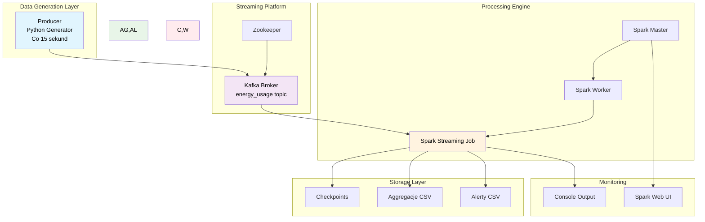
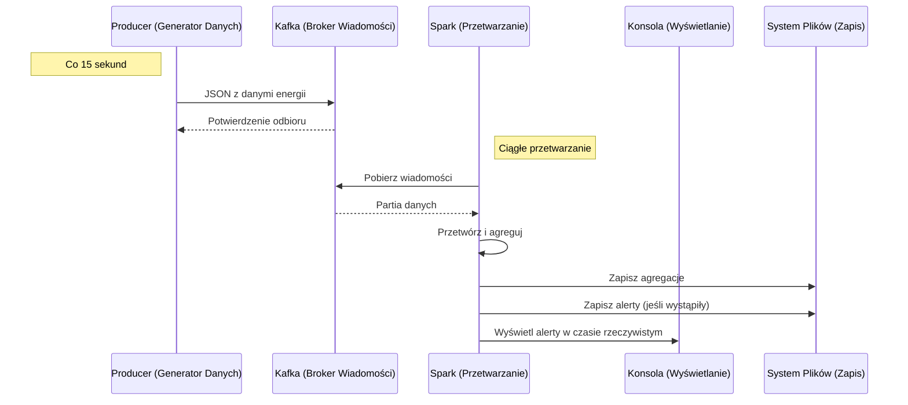

# System Monitorowania Zużycia Energii w Czasie Rzeczywistym

### Autorzy: Mateusz Waszczuk (193666), Grzegorz Macioch (193670)

##  Spis Treści
- [ Cel Projektu](#cel-projektu)
- [ Architektura Systemu](#architektura-systemu)
- [ Wymagane Komponenty](#wymagane-komponenty)
- [ Uruchomienie i Konfiguracja](#uruchomienie-i-konfiguracja)
- [ Weryfikacja Działania](#weryfikacja-działania)
- [ Przetwarzanie Danych](#przetwarzanie-danych)
- [ Wykrywanie Anomalii](#wykrywanie-anomalii)
- [ Output i Wyniki](#output-i-wyniki)
- [ Workflow Systemu](#workflow-systemu)

## Cel Projektu

System monitorowania zużycia energii w gospodarstwach domowych z wykrywaniem anomalii w czasie rzeczywistym. Projekt wykorzystuje Apache Spark Streaming i Apache Kafka do przetwarzania strumieniowego danych.

## Architektura Systemu


## Wymagane Komponenty
- Docker & Docker Compose

- Apache Kafka (via Docker)

- Apache Spark 3.5.1 (via Docker)

- Python 3.9+ z kafka-python

- Java 8+ (dla Spark)

## Uruchomienie i Konfiguracja

```
#Uruchomienie infrasturktury
docker-compose -f docker-compose-all.yml up -d

#Poczekaj 30s na inicjalizację Kafki

#Uruchom przetwarzanie Spark
docker exec -it spark-master spark-submit --packages org.apache.spark:spark-sql-kafka-0-10_2.12:3.5.1 /app/app/spark_streaming.py
```

## Weryfikacja Działania

```
# Sprawdzenie czy producer wysyła dane
docker logs energy-producer -f

# Sprawdzenie topic Kafka
docker exec -it kafka kafka-topics --list --bootstrap-server localhost:9092

# Monitorowanie Spark UI
open http://localhost:8080
```
## Przetwarzanie Danych

### Pipeline Przetwarzania:
#### 1. Odczyt z Kafka - Format binarny:
- Pozyskiwanie surowych danych z topicu Kafka energy_usage
- Dane w początkowym formacie binarnym
- Konfiguracja połączenia z brokerem Kafka

#### 2. Parsowanie JSON:
- Konwersja danych binarnych na string JSON
- Wyodrębnienie pól JSON do strukturyzowanego DataFrame
- Walidacja i czyszczenie danych

#### 3. Watermarking (Obsługa 5-minutowego opóźnienia)

#### 4. Grupowanie danych w 15-minutowe okna czasowe

#### 5. Wykrywanie anomalii (zużycie >2kWh/15min)

#### 6. Zapis agregacji i alertów do plików CSV

### Generowanie wartości zużycia (producer_docker.py):

```
    if random.random() < 0.15:
        energy_kwh = round(random.uniform(2.5, 2), 6) 
    else:
        energy_kwh = round(random.uniform(0.0005, 0.0015), 6) 
```

## Wykrywanie Anomalii

- Progowanie: 2 kWh na 15-minutowe okno
- Typ alertu: HIGH_USAGE
- Czułość: 15% szansy na anomalie w danych testowych

### Przykładowy Alert
```
household_id,window_start,window_end,total_energy_kwh,alert_type
H003,2024-08-28 14:15:00,2024-08-28 14:30:00,0.187,HIGH_USAGE
```
## Output i Wyniki

### Pliki Wyjściowe

```
/output/
├── energy_aggregations/    # Sumy energii co 15 minut
├── alerts/                 # Wykryte anomalie
└── checkpoint/            # Stan przetwarzania Spark
```

## Workflow systemu
